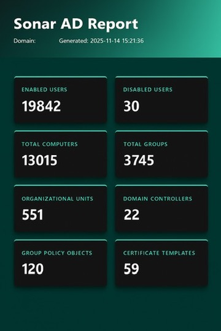
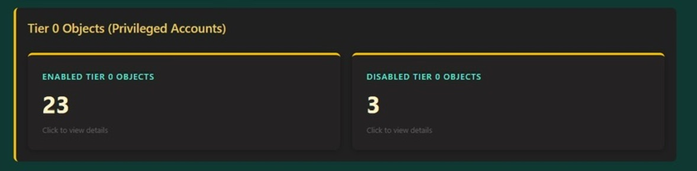
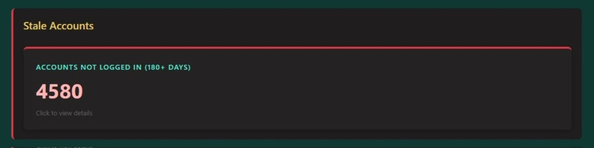
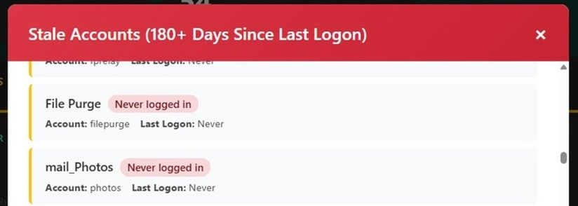

# Sonar-AD


> Beginning stages 

A simple PowerShell script to quickly grab and format high level Active Directory metrics 

## Features

### Core Metrics
- **User Accounts**: Enabled and disabled user counts
- **Groups**: Total group count
- **Computers**: Total computer objects
- **Organizational Units**: OU count
- **Domain Controllers**: DC count
- **Group Policy Objects**: GPO count
- **Certificate Templates**: Certificate template count

### Security Insights
- **Tier 0 Objects**: Identifies and reports on privileged accounts in:
  - Domain Admins
  - Enterprise Admins
  - Schema Admins
  - Shows enabled/disabled status and group membership
- **Stale Accounts**: Identifies accounts that haven't logged in for 180+ days
  - Displays last logon timestamp
  - Shows days since last logon
  - Helps identify accounts that may need review or removal

### Interactive HTML Report
- Interactive modals for detailed views on Tier 0 and Stale objects (more to come)
- Clickable cards to explore Tier 0 objects and stale accounts
- Sortable and filterable account lists
- Export-ready HTML format

## Requirements

- **PowerShell**: Version 5.1 or later
- **Active Directory Module**: RSAT-AD-PowerShell feature must be installed
- **Group Policy Module** (optional): For GPO counts (RSAT-GPMC-Mgmt-Console)
- **Permissions**: Read access to Active Directory objects
- **Domain**: Must be run on a machine joined to the target domain or with domain connectivity

### Installing RSAT-AD-PowerShell

**Windows 10/11:**
```powershell
Add-WindowsCapability -Online -Name Rsat.ActiveDirectory.DS-LDS.Tools~~~~0.0.1.0
```

**Windows Server:**
```powershell
Install-WindowsFeature RSAT-AD-PowerShell
```

## Usage

```./SonarAD.ps1```

Doesn't get much easier than that (: 

### Basic Usage

This will generate a report named `ADMetricsReport.html` in the current directory.


### Examples

#### Main Report 



#### Tier 0 Accounts 




#### Stale Accounts 





## Author

**@nateahess**

Created: November 14, 2025

## License

This project is provided as-is for use in Active Directory environments. Please ensure you have proper authorization before running this script in production environments.

## Contributing

Contributions, issues, and feature requests are welcome! Feel free to check the issues page or submit a pull request.

## Disclaimer

This tool is designed for legitimate Active Directory administration and security auditing purposes. Users are responsible for ensuring they have proper authorization before running this script in any environment. The authors are not responsible for any misuse of this tool.
